# ChatApp

A minimal 1-to-1 chat app built with Expo SDK 57 (iOS and Android). User can view conversations, read message history, send text optimistically, view a contact profile with client-only block, and manage theme (System / Light / Dark).

## UI/UX

Platform-adaptive UI via Unistyles: **iOS Liquid Glass** and **Android M3 Expressive** tonal surfaces, with the same layouts on both platforms. Theme follows System by default, with Light and Dark overrides.

### Conversations

| iOS                                                        | Android                                                            |
| ---------------------------------------------------------- | ------------------------------------------------------------------ |
| 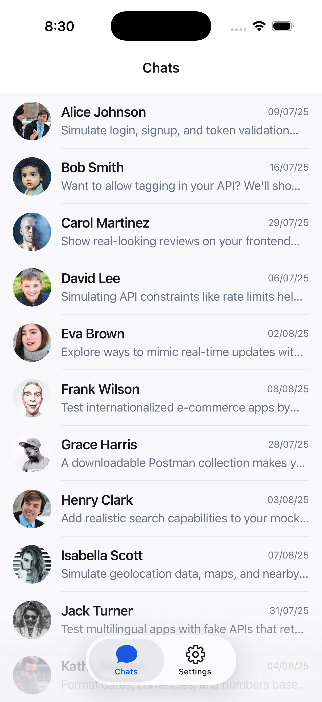 | 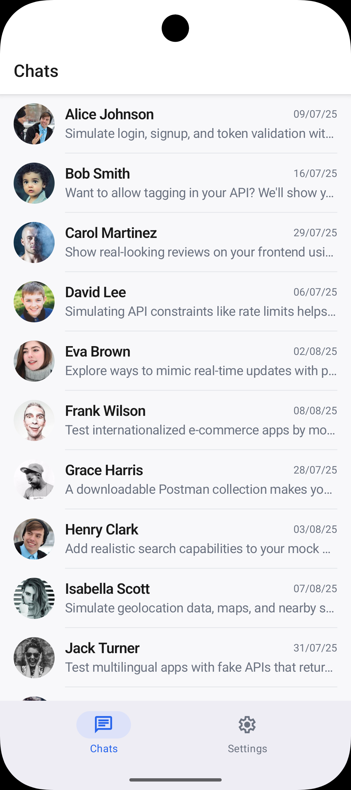 |

### Chat

| iOS                                      | Android                                          |
| ---------------------------------------- | ------------------------------------------------ |
| 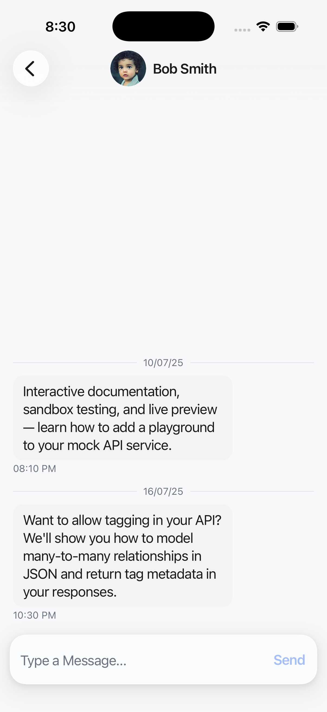 | 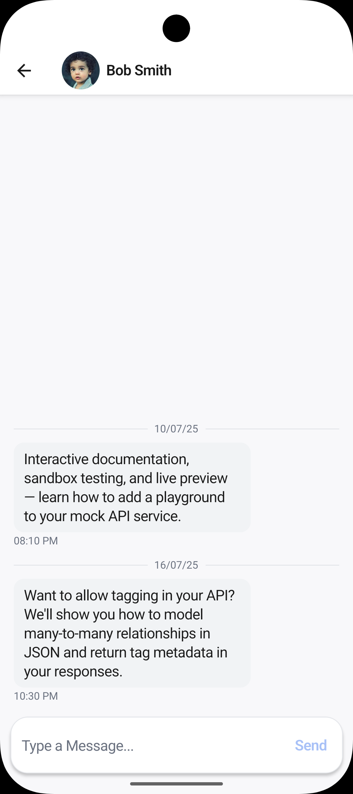 |

### Profile

| iOS                                            | Android                                                |
| ---------------------------------------------- | ------------------------------------------------------ |
| 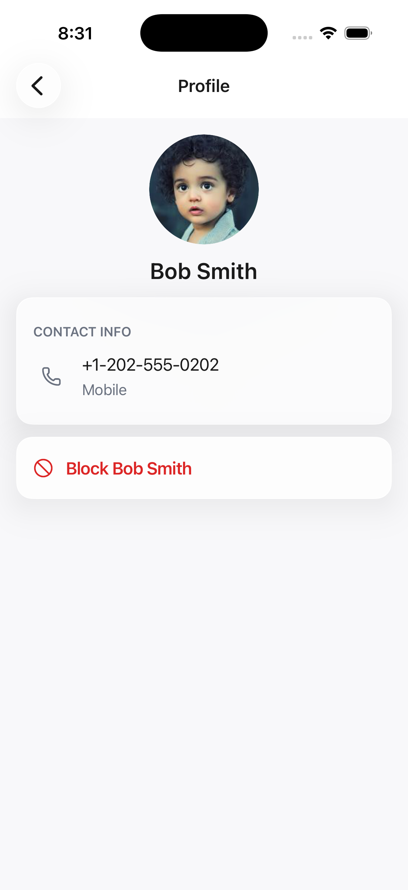 | 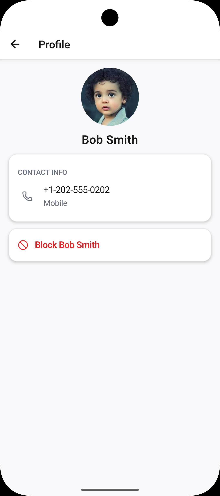 |

### Block sheet

| iOS                                                     | Android                                                         |
| ------------------------------------------------------- | --------------------------------------------------------------- |
| 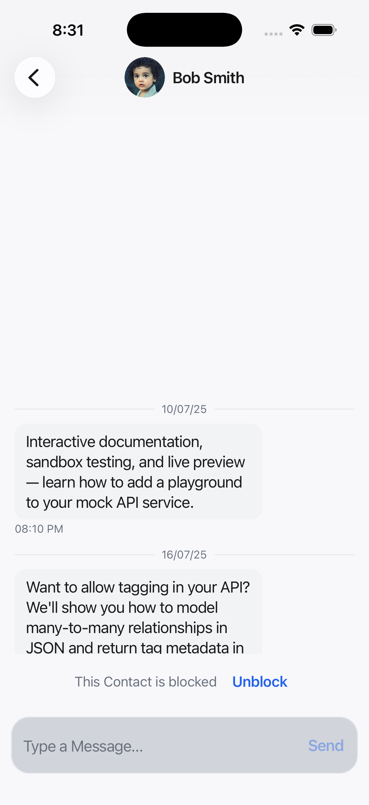 | 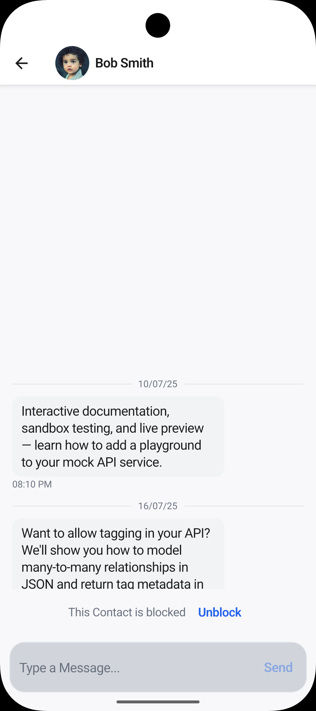 |

### Settings

| iOS                                              | Android                                                  |
| ------------------------------------------------ | -------------------------------------------------------- |
| 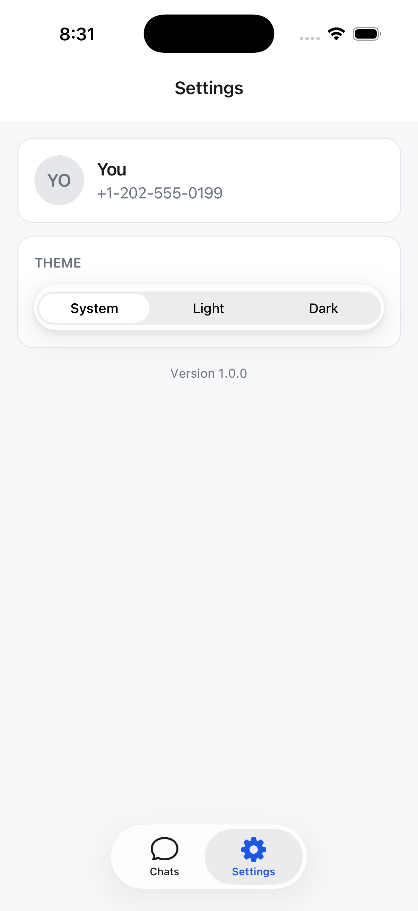 | 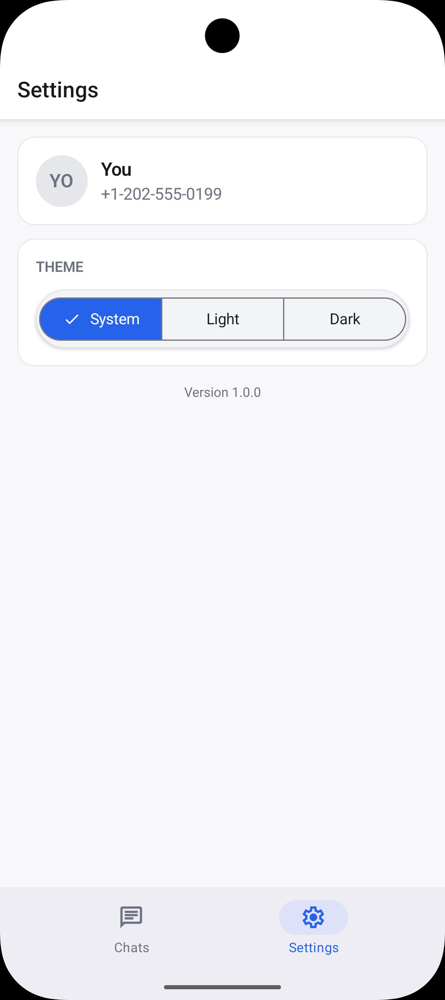 |

### Theme — Dark

| iOS                                                          | Android                                                              |
| ------------------------------------------------------------ | -------------------------------------------------------------------- |
| 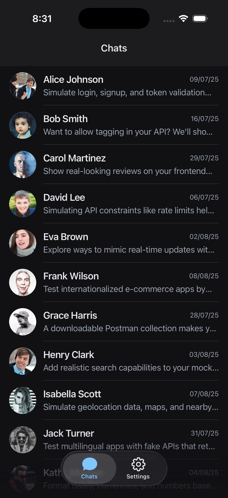 | 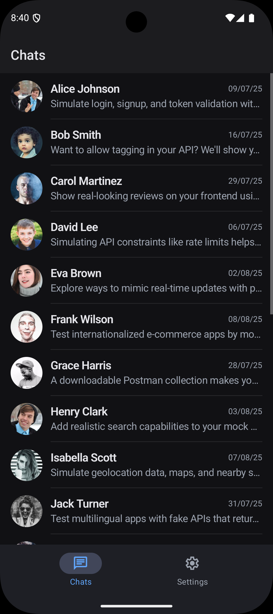 |

## Requirements

- Node.js 20+
- [pnpm](https://pnpm.io/)
- Xcode (iOS) and/or Android Studio (Android)

## Get started

```bash
pnpm install
pnpm start
```

Then open the app in a development build, iOS simulator, or Android emulator.

### Scripts

| Command          | Description                 |
| ---------------- | --------------------------- |
| `pnpm start`     | Start Expo                  |
| `pnpm ios`       | Run on iOS                  |
| `pnpm android`   | Run on Android              |
| `pnpm test`      | Jest unit / component tests |
| `pnpm lint`      | ESLint                      |
| `pnpm format`    | Prettier write              |
| `pnpm typecheck` | TypeScript `--noEmit`       |

## Project structure

```
src/
  app/           Expo Router routes and layouts only; screens live in features/
  features/      Domain modules: conversations, chat, profile, settings
  services/      External integrations (API transport)
  lib/           Third-party clients and providers
  store/         Client-only Redux Toolkit
  utils/         Pure helpers
  theme/         Unistyles tokens and themes
  components/    Shared UI components
  hooks/         Shared device-preference hooks (Reduce Motion / Transparency)
```

### Architecture

- All HTTP uses one axios client. Endpoints live only in `src/services/api/endpoints.ts`.
- TanStack Query owns server data (conversations, messages, profile). Redux Toolkit owns client-only Block and Theme. Block persist is encrypted; Theme persist is plain MMKV.
- Query keys are a single factory in `src/lib/query-keys.ts`, so a successful send can patch the conversations preview instead of refetching.

UI is platform-adaptive via Unistyles: **iOS Liquid Glass**, **Android M3 Expressive** tonal surfaces.

Send is optimistic: when send clicked, append to query data, then set as sending. Once server return success, replace data with server data; failure gets inline retry; failed sends stay in memory-only (query-cache) and dropped on restart.
